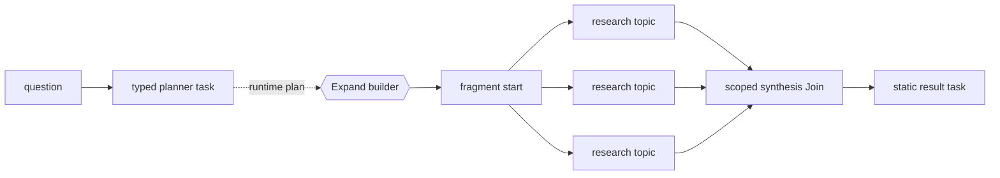

# Adaptive Research

This credential-free example uses a typed research plan to materialize one
research node per selected topic, then joins the findings into one report.

!!! warning "Capability status"
    Tasks, binding, fan-out, scoped joins, and policy validation are
    **Available**. Runtime `Expand` / `Fragment` materialization is
    **Experimental**. Expansion budgets and final materialized-graph inspection
    are **Planned**.

## Conceptual graph

This Mermaid diagram is hand-authored documentation. Elan does not currently
provide declaration-only graph rendering.



## Complete example

```python
import asyncio

from pydantic import BaseModel

from elan import Binder, Expand, Fragment, Join, Node, Workflow, WorkflowPolicy, task


class ResearchPlan(BaseModel):
    question: str
    topics: list[str]


class Finding(BaseModel):
    topic: str
    summary: str


@task
async def plan_research(question: str) -> ResearchPlan:
    return ResearchPlan(
        question=question,
        topics=["orchestration model", "runtime expansion", "reviewability"],
    )


@task
async def open_research(plan: ResearchPlan) -> ResearchPlan:
    return plan


@task
async def research_topic(plan: ResearchPlan, topic: str) -> Finding:
    return Finding(topic=topic, summary=f"evidence about {topic}")


@task
async def synthesize(findings: list[Finding]) -> str:
    topics = ", ".join(sorted(finding.topic for finding in findings))
    return f"Research complete: {topics}."


@task
async def publish(report: str) -> str:
    return report


def build_research(plan: ResearchPlan) -> Fragment:
    topic_nodes = {
        f"topic_{index}": Node(
            run=research_topic,
            bind_input=Binder[research_topic](topic=topic),
            next="synthesis",
        )
        for index, topic in enumerate(plan.topics)
    }
    return Fragment(
        start=Node(run=open_research, next=list(topic_nodes)),
        **topic_nodes,
        synthesis=Join(run=synthesize, scope="start", next="result"),
    )


workflow = Workflow(
    "adaptive_research",
    policy=WorkflowPolicy(
        allow_runtime_expansion=True,
        max_parallel_tasks=4,
    ),
    start=Node(run=plan_research, next=Expand(build_research)),
    result=publish,
)

run = asyncio.run(
    workflow.run(question="How should AI-written workflows remain reviewable?")
)
print(run.result)
```

Expected output:

```text
Research complete: orchestration model, reviewability, runtime expansion.
```

## Why ordinary fan-out is not enough

A generator or static fan-out is appropriate when every item follows one known
route. Here the typed planning result is the orchestration boundary: it chooses
the named work declarations that belong to this run and can later choose
different task chains or fragment-local joins. `Expand` makes that graph-growth
decision explicit instead of hiding it inside the planner task.

The deterministic planner can be replaced by an LLM-backed registered task that
returns the same `ResearchPlan`. The builder and the rest of the workflow do not
need to change.

## Current limitations

- The conceptual diagram must be maintained by hand.
- Expanded node names are run-local and are not exported as a serialized final
  graph.
- Expansion has no built-in materialization budget.
- Recursive builders must provide their own terminating condition.
- Join arrival order is unspecified, so `synthesize` sorts its values.

See [Dynamic Execution](dynamic-execution.md) for the exact expansion contract.
