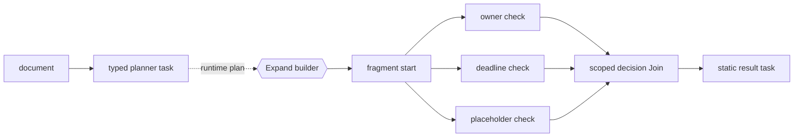

# Document Decisioning

This credential-free example turns a typed decision plan into explicit parallel
checks and one deterministic approval result.

!!! warning "Capability status"
    Typed payloads, binding, fan-out, scoped joins, and policy validation are
    **Available**. Runtime `Expand` / `Fragment` materialization is
    **Experimental**. Durable human approval checkpoints are **Direction**.

## Conceptual graph

This Mermaid diagram is hand-authored documentation. Elan does not currently
provide declaration-only graph rendering.



## Complete example

```python
import asyncio

from pydantic import BaseModel

from elan import Binder, Expand, Fragment, Join, Node, Workflow, WorkflowPolicy, task


class DecisionPlan(BaseModel):
    document: str
    checks: list[str]


class CheckResult(BaseModel):
    check: str
    passed: bool


@task
async def plan_decision(document: str) -> DecisionPlan:
    return DecisionPlan(
        document=document,
        checks=["has-owner", "has-deadline", "contains-no-placeholder"],
    )


@task
async def open_decision(plan: DecisionPlan) -> DecisionPlan:
    return plan


@task
async def evaluate_check(plan: DecisionPlan, check_name: str) -> CheckResult:
    checks = {
        "has-owner": "owner:" in plan.document.lower(),
        "has-deadline": "deadline:" in plan.document.lower(),
        "contains-no-placeholder": "todo" not in plan.document.lower(),
    }
    return CheckResult(check=check_name, passed=checks[check_name])


@task
async def decide(results: list[CheckResult]) -> str:
    failures = sorted(result.check for result in results if not result.passed)
    return "approved" if not failures else f"review required: {', '.join(failures)}"


@task
async def publish_decision(decision: str) -> str:
    return decision


def build_decision(plan: DecisionPlan) -> Fragment:
    check_nodes = {
        f"check_{index}": Node(
            run=evaluate_check,
            bind_input=Binder[evaluate_check](check_name=check),
            next="decision",
        )
        for index, check in enumerate(plan.checks)
    }
    return Fragment(
        start=Node(run=open_decision, next=list(check_nodes)),
        **check_nodes,
        decision=Join(run=decide, scope="start", next="result"),
    )


workflow = Workflow(
    "document_decision",
    policy=WorkflowPolicy(
        allow_runtime_expansion=True,
        max_parallel_tasks=4,
    ),
    start=Node(run=plan_decision, next=Expand(build_decision)),
    result=publish_decision,
)

run = asyncio.run(
    workflow.run(
        document="Owner: platform team\nDeadline: Friday\nStatus: ready"
    )
)
print(run.result)
```

Expected output:

```text
approved
```

## Why fixed routing is insufficient

A fixed graph works when every document needs the same checks. In this shape,
the typed planner owns check selection and the fragment makes those selected
checks visible as run-specific work. An LLM-backed planner may replace
`plan_decision` if it returns the same validated `DecisionPlan`; deterministic
tasks retain authority over evaluation and the exported decision.

## Current limitations

- This example returns a result immediately; it does not persist or resume a
  human approval checkpoint.
- The conceptual graph is maintained by hand.
- Expanded graph serialization and materialization budgets are **Planned**.
- `decide` sorts failures because join arrival order is unspecified.

See [Dynamic Execution](dynamic-execution.md) for the exact expansion contract.
