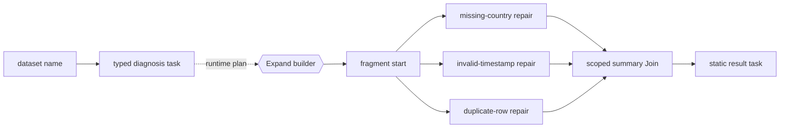

# AI-assisted ETL Recovery

This credential-free simulation uses a typed diagnosis to select repair work,
then joins the results into a deterministic recovery summary. It performs no
network calls and mutates no data.

!!! warning "Capability status"
    Typed payloads, binding, concurrency, and scoped joins are **Available**.
    Runtime `Expand` / `Fragment` materialization is **Experimental**. Retries,
    persisted runs, and remote workers are **Direction**.

## Conceptual graph

This Mermaid diagram is hand-authored documentation. Elan does not currently
provide declaration-only graph rendering.



## Complete example

```python
import asyncio

from pydantic import BaseModel

from elan import Binder, Expand, Fragment, Join, Node, Workflow, WorkflowPolicy, task


class RecoveryPlan(BaseModel):
    dataset: str
    issues: list[str]


class RepairResult(BaseModel):
    issue: str
    action: str


@task
async def diagnose(dataset: str) -> RecoveryPlan:
    return RecoveryPlan(
        dataset=dataset,
        issues=["missing-country", "invalid-timestamp", "duplicate-row"],
    )


@task
async def open_recovery(plan: RecoveryPlan) -> RecoveryPlan:
    return plan


@task
async def repair_issue(plan: RecoveryPlan, issue: str) -> RepairResult:
    actions = {
        "missing-country": "infer from billing region",
        "invalid-timestamp": "quarantine and reparse",
        "duplicate-row": "retain latest source record",
    }
    return RepairResult(issue=issue, action=actions[issue])


@task
async def summarize(results: list[RepairResult]) -> str:
    repaired = ", ".join(sorted(result.issue for result in results))
    return f"Recovered {len(results)} issue classes: {repaired}."


@task
async def export_summary(summary: str) -> str:
    return summary


def build_recovery(plan: RecoveryPlan) -> Fragment:
    repair_nodes = {
        f"repair_{index}": Node(
            run=repair_issue,
            bind_input=Binder[repair_issue](issue=issue),
            next="summary",
        )
        for index, issue in enumerate(plan.issues)
    }
    return Fragment(
        start=Node(run=open_recovery, next=list(repair_nodes)),
        **repair_nodes,
        summary=Join(run=summarize, scope="start", next="result"),
    )


workflow = Workflow(
    "etl_recovery",
    policy=WorkflowPolicy(
        allow_runtime_expansion=True,
        max_parallel_tasks=4,
    ),
    start=Node(run=diagnose, next=Expand(build_recovery)),
    result=export_summary,
)

run = asyncio.run(workflow.run(dataset="daily-orders"))
print(run.result)
```

Expected output:

```text
Recovered 3 issue classes: duplicate-row, invalid-timestamp, missing-country.
```

## Why ordinary fan-out is not enough

Ordinary fan-out is sufficient when every issue uses one fixed repair route.
Here the diagnosis is a typed graph-planning boundary: selected issue classes
become named run-specific work and may later choose different repair chains or
fragment-local synchronization. An LLM may assist diagnosis while deterministic
tasks retain authority over any real data operation.

## Current limitations

- Repairs are simulated; the example deliberately makes no production changes.
- Elan does not currently persist, retry, or resume failed runs.
- Expanded graph serialization and materialization budgets are **Planned**.
- The conceptual graph is maintained by hand.
- `summarize` sorts issue names because join arrival order is unspecified.

See [Dynamic Execution](dynamic-execution.md) for the exact expansion contract.
